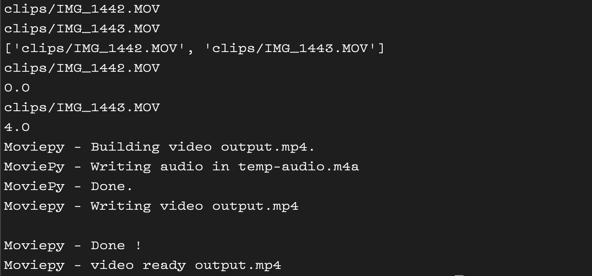

[](https://github.com/neonite2217)
[](https://github.com/neonite2217?tab=repositories)


## 🛠️ Description
This script takes in a directory of video clips, and outputs one video clip featuring all of the input clips.
However, it plays them back in real time. For example, if you filmed a one minute clip from 5:01 to 5:02, and another one minute clip from 5:05 to 5:06, the output clip would be 5 minutes in length. The first minute of the output clip would be the first input clip, then there would be 3 minutes of just a black screen. Finally, the last minute of hte output clip would be the second input clip. This is useful for syncing up b-roll and organizing clips. 

## 📺 Demo


## ⚙️ Languages or Frameworks Used
You need to install MoviePy. You may also need to install some audio codecs in some machines.

## 🌟 How to run
Clone the repo
sh ''' git clone https://github.com/neonite2217/python-projects.git'''

Install required modules

```sh
sudo apt-get install moviepy
```
or

```sh
pip3 install moviepy
```

Copy all of the clips you want to use into the clips folder.

Navigate to the file to run and all set!!

```sh
python3 main.py
```

Note- make sure you don't have a .DS_store file in the clips directory. This can cause issues.


## 🤖 Author
[Biswaketan](https://github.com/neonite2217)
