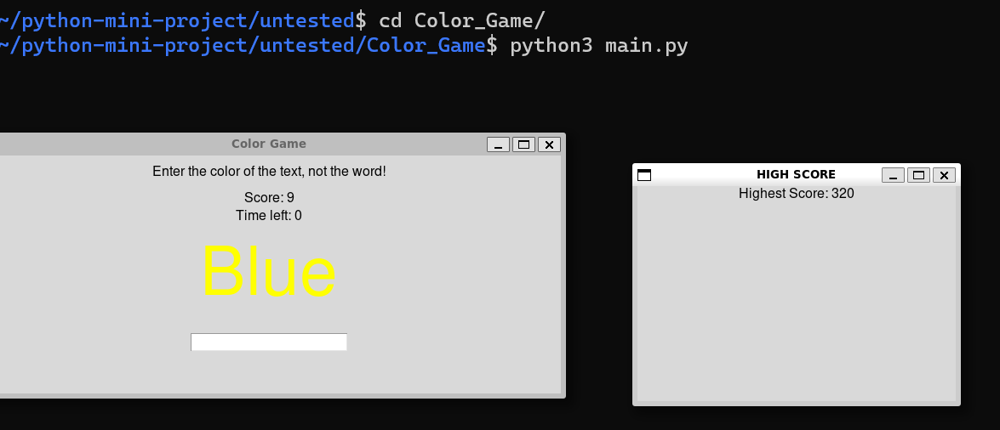

[](https://github.com/neonite2217)
[](https://github.com/neonite2217?tab=repositories)

# COLOR GAME

## 🛠️ Description
A simple color game

_**Mechanics:**_ 
* You must enter the color of the word, not the text itself.
* You have 30 seconds to play every round.    
* The highest score will be recorded in the .txt file.

## ⚙️ Languages or Frameworks Used
language used - python3.
Packages required - tinker

## 🌟 How to run the script
Running this game is easy.
Clone the Repository

```sh
git clone https://github.com/neonite2217/python-projects.git
```
Install required modules

```sh
sudo apt-get install tinker
```
or

```sh
pip3 install tinker
```

Navigate to the file and run 
```sh
python3 main.py
```
#### DEMO


## 🤖 Author
[Biswaketan](https://github.com/neonite2217/)
