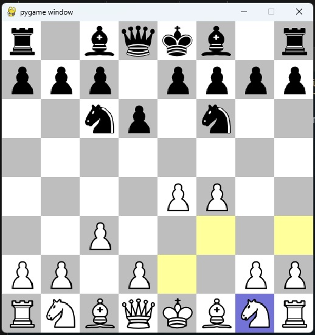

# Chess Game 

## 🛠️ Description
A simple chess game that you can play with your friend.

## ⚙️ Languages or Frameworks Used
This game is created in python programming language.
Modules : pygame

## 🌟 How to run the script
Running this game is easy.
Clone the Repository
```sh
git clone https://github.com/neonite2217/python-projects.git
```
Install required modules
```sh
sudo apt-get install python3-pygame
```
Navigate to the file and run 
```sh
python ChessGame.py
```

## 📺 Demo
<p align="center">


## *Author Name*
[Biswaketan](https://github.com/neonite2217)
