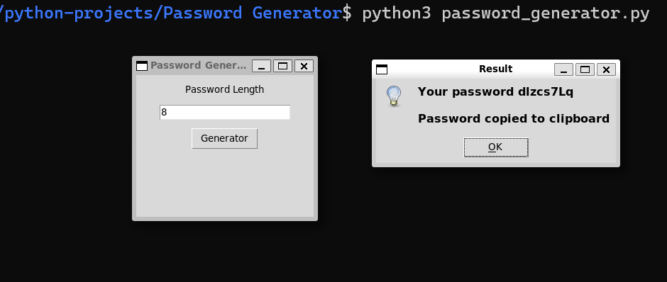

[](https://github.com/neonite2217)
[](https://github.com/neonite2217?tab=repositories)


# Password Generator

## 🛠️ Description
Create secure passwords in seconds, it's designed to be small in size so you can multitask and copies the password to your clipboard.

## ⚙️ Languages or Frameworks Used
language used - python3.
Packages required - •tkinter  •pyperclip


## 🌟 How to run the script
Running this game is easy.
Clone the Repository

```sh
git clone https://github.com/neonite2217/python-projects.git
```
Install required modules

```sh
pip install tkinter
```
then,

```sh
pip install pyperclip
```

Navigate to the file and run 
```sh
python3 password_generator.py
```

## 📺 Demo
<p align="center">



## 🤖 Author
[Biswaketan](https://github.com/neonite2217/)
