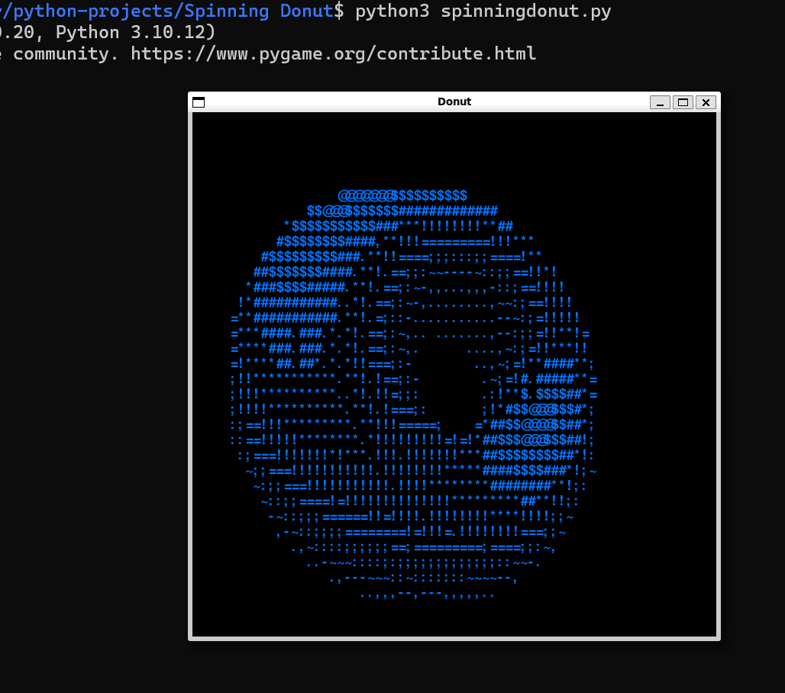

[](https://github.com/neonite2217)
[](https://github.com/neonite2217?tab=repositories)

# Spinning Donut

## 🛠️ Description
This project uses the Pygame library to create an animation of a spinning donut on a black background.
It's a replica/ slightly modify version of [Gideon Ogunbanjo's](https://github.com/gideon-ogunbanjo) project.
Gideon Ogunbanjo acknowledged as original author

## ⚙️  Languages or Frameworks Used
The program was created with Python3 and pygame.

## 🌟 How to run the script
Running this game is easy.
Clone the Repository

```sh
git clone https://github.com/neonite2217/python-projects.git
```
Install required modules

```sh
pip3 install pygame
```

Navigate to the file and run 
```sh
python3 spinningdonut.py
```
## 📺 Demo
<p align="center">


## 🤖 Author
[Biswaketan](https://github.com/neonite2217/)
