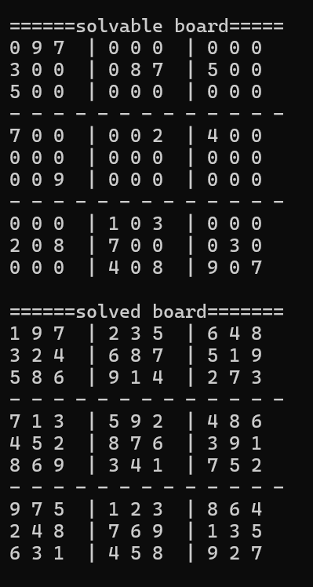

[](https://github.com/neonite2217)
[](https://github.com/neonite2217?tab=repositories)

# Sudoku solver

<p align="center">


## 🛠️ Description
This program can generates Sudoku boards and provides their solution as well.

## ⚙️ Languages or Frameworks Used
You only need Python to run this script.

## 🌟 How to run
Clone the Repository

```sh
git clone https://github.com/neonite2217/python-projects.git
```
Navigate to the file and run 
```sh
python3 main.py
```

NOTE:
By default, it generates a board and solves it straight away.
If you want to get your own board solved you have to look at the bottom of the file.
Just fill in the number of your board and use a comment to disable the board generator below.

## 📺 Demo
<p align="center">


## 🤖 Author
[Biswaketan](https://github.com/neonite2217/)
