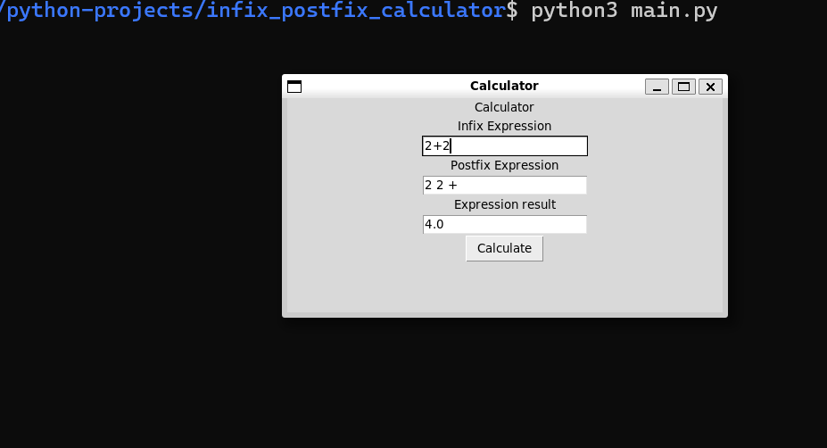

[](https://github.com/neonite2217)
[](https://github.com/neonite2217?tab=repositories)

# Python Infix/Postfix Calculator

## 🛠️ Description
This is a tool for converting Infix expressions to postfix equivalent followed but the result
 
## 🌟 How to run the script
Running this game is easy.
Clone the Repository

```sh
git clone https://github.com/neonite2217/python-projects.git
```

Navigate to the file and run 
```sh
python3 main.py
```

## 📺 Demo
<p align="center">


## 🤖 Author
[Biswaketan](https://github.com/neonite2217/)
